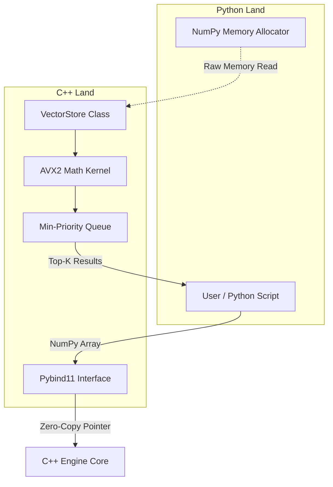

# Vectra-X: High-Performance C++ Vector Search Engine with Python Bindings

**Vectra-X** is an embedded, high-performance vector search engine designed to demonstrate advanced C++ optimization techniques, SIMD acceleration, and efficient foreign function interfaces (FFI) with Python.

Designed as an educational yet functional prototype, it addresses the **"Two-Language Problem"** in high-performance computing (HPC): utilizing Python for its ease of use and ecosystem (NumPy, PyTorch) while leveraging C++ for the computationally intensive L2 distance calculations required by vector search.

This project deliberately avoids high-level abstractions in the critical path, opting instead for **Data-Oriented Design**, **manual memory layouts**, and **processor-specific intrinsics** (AVX2).

---

## 📚 Table of Contents
1.  [Project Motivation](#project-motivation)
2.  [High-Level Architecture](#high-level-architecture)
3.  [Detailed Technical Implementation](#detailed-technical-implementation)
    *   [Memory Model: The Flat Storage Strategy](#memory-model-the-flat-storage-strategy)
    *   [SIMD Acceleration: AVX2 Details](#simd-acceleration-avx2-details)
    *   [Search Algorithm: Min-Heap k-NN](#search-algorithm-min-heap-k-nn)
    *   [Python-C++ Bridge: Zero-Copy Protocol](#python-c-bridge-zero-copy-protocol)
4.  [Folder Structure](#folder-structure)
5.  [Build System & Environment](#build-system--environment)
6.  [Installation & Usage](#installation--usage)
7.  [Future Roadmap](#future-roadmap)
8.  [License](#license)

---

## Project Motivation

Modern AI applications rely heavily on vector embeddings (dense floating-point arrays representing text or images). Finding the "nearest" vector to a query is an $O(N \cdot D)$ operation, where $N$ is the dataset size and $D$ is the dimensionality.

In pure Python, this is prohibitively slow. While libraries like Faiss exist, understanding *how* to build one requires mastering several distinct domains:
1.  **Hardware-aware C++**: Understanding cache lines and SIMD registers.
2.  **Compiler interactions**: How flags like `/arch:AVX2` or `-mfma` change code generation.
3.  **Cross-language bindings**: Passing memory pointers safely between Python and C++.

Vectra-X is a clean-sheet implementation of these concepts, serving as a reference for building high-scale search infrastructure.

---

## High-Level Architecture

The system operates as a hybrid application: two languages, shared memory.



1.  **Storage Layer**: A strictly typed, contiguous memory block managed by C++.
2.  **Compute Layer**: An AVX2-optimized distance kernel that processes 8 dimensions per CPU cycle.
3.  **Interface Layer**: A `pybind11` module that exposes the C++ class as a native Python object, `vectrax.VectorStore`.

---

## Detailed Technical Implementation

### Memory Model: The Flat Storage Strategy
**File:** `include/VectorStore.hpp`

Most naive C++ implementations store vectors as a "Vector of Vectors":
```cpp
// BAD: Cache Thrashing
std::vector<std::vector<float>> data;
```
This causes **heap fragmentation**. Each inner vector is allocated separately in memory. Iterating through them involves "pointer chasing," which causes CPU cache misses (L1/L2 cache inefficiency).

**Vectra-X uses a "Flat Layout":**
```cpp
// GOOD: Spatial Locality
std::vector<float> data_; 
// Access vector i at: data_.data() + (i * dim_)
```
*   **Why?** Modern CPUs fetch memory in **"Cache Lines"** (typically 64 bytes). By keeping data contiguous, a single cache line fetch loads 16 consecutive float values. When the SIMD kernel processes vector $i$, the pre-fetcher has likely already pulled vector $i+1$ into the L1 cache.
*   **Result**: The bottleneck shifts from memory latency (waiting for RAM) to memory bandwidth (how fast bytes can move), which is a much higher ceiling.

### SIMD Acceleration: AVX2 Details
**File:** `src/VectorStore.cpp`

We use **Intel AVX2 (Advanced Vector Extensions 2)** to parallelize the L2 distance calculation.

The standard Euclidean distance formula is:
$$ d = \sum (a_i - b_i)^2 $$

In scalar code, this is one subtraction and one multiply per dimension (2 ops).
In Vectra-X, we use intrinsics to process **8 floats at once**:

1.  `_mm256_loadu_ps`: Load 8 floats from memory (unaligned).
2.  `_mm256_sub_ps`: Subtract 8 floats in parallel.
3.  `_mm256_fmadd_ps`: "Fused Multiply-Add". Performs `(diff * diff) + accumulator` in a single CPU cycle.

This theoretically offers an **8x speedup** over scalar processing, though in practice memory bandwidth limits the gain to around 4-6x.

### Search Algorithm: Min-Heap k-NN
**File:** `src/VectorStore.cpp` (`search` method)

To find the top-$k$ nearest neighbors:
1.  We iterate over *every* vector in the store (Brute Force).
2.  We calculate the distance to the query.
3.  We maintain a **Min-Priority Queue** of size $k$.

**The Optimization Logic:**
*   We use a `std::priority_queue` containing pairs of `(-distance, id)`.
*   Why negative distance? The C++ `priority_queue` is a Max-Heap by default. By negating the distance, the "largest" value (which is conceptually the numerically smallest negative number, i.e., the closest neighbor) sinks to the bottom.
*   The implementation uses a `GreaterKey` comparator (`>`) which turns the queue into a Min-Heap based on the first element (key).
*   **Logic**: We push `(-distance, id)`. If size > $k$, we `pop()`. In a Min-Heap, `pop()` removes the *smallest* element (most negative distance = largest actual distance). This ensures we keep the closest neighbors.

### Python-C++ Bridge: Zero-Copy Protocol
**File:** `src/main.cpp`

The Python binding is not just a wrapper; it contains logic to prevent memory copies.

When you call `store.add_vector(np_array)`, `pybind11` does not copy the array into a C++ `std::vector`. instead:
1.  `py::buffer_info` requests the raw memory address of the NumPy array.
2.  **Safety Checks**:
    *   `ndim == 1`: Must be a flat vector.
    *   `strides[0] == sizeof(float)`: Must be contiguous (no sliced arrays like `arr[::2]`).
    *   `format`: Must be `float32` (standard C floats).
3.  **Pointer Cast**: `float* ptr = static_cast<float*>(buf.ptr)`.

This pointer is passed directly to the C++ core. If the user passes a 1GB dataset, **0 bytes are copied** during the API call transition—only the internal storage logic decides if it needs to copy it (which it does, into `VectorStore::data_`).

---

## Folder Structure

```text
Vectra-X/
├── include/
│   ├── VectorStore.hpp      # Header: Class definitions & Flat Layout logic
│   └── HNSWIndex.hpp        # Header: Graph definitions (Architecture reference)
├── src/
│   ├── main.cpp             # Pybind11 Entry point & Buffer Protocol validation
│   └── VectorStore.cpp      # Implementation: AVX2 Kernels & Heap Search
├── setup.py                 # Build script (Compiler flag injection)
├── pyproject.toml           # Python package metadata
├── CMakeLists.txt           # (Optional) CMake configuration for standalone C++ builds
└── README.md                # Documentation
```

---

## Build System & Environment

The build system (`setup.py`) is intelligent and platform-aware.

### Compiler Flag Methodology
Standard helper libraries don't always pick optimal flags for scientific computing. Our `setup.py` explicitly injects them:

1.  **Windows (MSVC/Visual Studio 2022)**:
    *   `/O2`: Maximize speed.
    *   `/arch:AVX2`: Use Advanced Vector Extensions 2. *Note: MSVC does not use `-O3`.*
    
2.  **Linux/macOS (GCC/Clang)**:
    *   `-O3`: Aggressive optimization.
    *   `-mavx2`: Enable AVX2 instructions.
    *   `-mfma`: Enable Fused Multiply-Add (crucial for dot products/L2 norms).

### Standard Compliance
The project enforces **C++17** (`cxx_std=17`). This ensures access to modern language features while maintaining compatibility with most enterprise compilers.

---

## Installation & Usage

### Prerequisites
*   **Operating System**: Windows 10/11, Linux, or macOS.
*   **Compiler**: 
    *   Windows: Visual Studio Build Tools 2022 (with "Desktop development with C++").
    *   Linux: `build-essential` (GCC 7+).
*   **Python**: Version 3.8 or higher.

### Installing from Source

```bash
# 1. Clone the repository
git clone https://github.com/Start-Failing-Forward/Vectra-X.git
cd Vectra-X

# 2. Install via pip (triggers compilation)
pip install .
```

*Note: On Windows, ensure you run this from an environment where `cl.exe` is accessible, or rely on `pip` to find the Visual Studio Build Tools automatically.*

### Usage Example

```python
import numpy as np
import vectrax

# 1. Initialize the store (Dimension = 128)
# Memory is allocated for the flat vector storage.
store = vectrax.VectorStore(dim=128)

# 2. Generate Dummy Data
# IMPORTANT: Data must be float32 to match C++ 'float' type.
# Python 'float' is actually C++ 'double' (64-bit).
vec_a = np.random.rand(128).astype(np.float32)
vec_b = np.random.rand(128).astype(np.float32)

# 3. Add Vectors
# 'id' is an arbitrary integer identifier for the vector.
store.add_vector(id=1, vec=vec_a)
store.add_vector(id=2, vec=vec_b)

print(f"Store size: {store.size}")

# 4. Search
# We search for the nearest neighbor to 'vec_a' (which should be itself).
# k=2 returns top 2 results.
results = store.search(query=vec_a, k=2)

for dist, vector_id in results:
    print(f"ID: {vector_id}, Distance: {dist:.5f}")
```

---

## Future Roadmap

While Vectra-X is efficient for datasets up to ~1 million vectors, scaling to billions requires algorithmic improvements:

1.  **HNSW (Hierarchical Navigable Small World)**:
    *   *Current State*: `include/HNSWIndex.hpp` contains the node structure and architectural stub.
    *   *Goal*: Implement the graph-based approximate search to reduce complexity from $O(N)$ to $O(\log N)$.
2.  **Product Quantization (PQ)**:
    *   *Current State*: Not implemented (Full precision float32 only).
    *   *Goal*: Compress vectors from 512 bytes to 16-32 bytes using sub-space clustering, allowing billion-scale datasets to fit in RAM.
3.  **Multithreading**:
    *   *Goal*: Use OpenMP to parallelize the outer loop of the `search` function across multiple CPU cores.

---

## License

This project is open-source and available under the **MIT License**.
