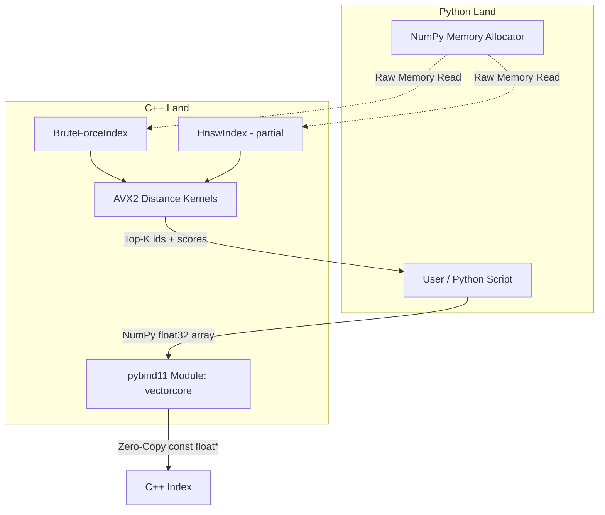

# VectorCore (Vectra-X): High-Performance C++ Vector Search Engine with Python Bindings

**VectorCore** is an embedded, high-performance vector search engine designed to demonstrate advanced C++ optimization techniques, SIMD acceleration, and efficient foreign function interfaces (FFI) with Python.

Designed as an educational yet functional prototype, it addresses the **"Two-Language Problem"** in high-performance computing (HPC): using Python for its ease of use and ecosystem (NumPy, PyTorch, sentence-transformers) while leveraging C++ for the computationally intensive distance calculations required by vector search.

This project deliberately avoids high-level abstractions in the critical path, opting instead for **Data-Oriented Design**, **flat memory layouts**, and **processor-specific intrinsics** (AVX2 + FMA).

---

## 📚 Table of Contents
1.  [Project Motivation](#project-motivation)
2.  [High-Level Architecture](#high-level-architecture)
3.  [Public API](#public-api)
4.  [Detailed Technical Implementation](#detailed-technical-implementation)
    *   [Memory Model: The Flat Storage Strategy](#memory-model-the-flat-storage-strategy)
    *   [SIMD Acceleration: AVX2 Details](#simd-acceleration-avx2-details)
    *   [Distance Metrics](#distance-metrics)
    *   [Search Algorithm: Bounded Top-k Heap](#search-algorithm-bounded-top-k-heap)
    *   [Parallelism: OpenMP](#parallelism-openmp)
    *   [Python–C++ Bridge: Zero-Copy Protocol](#pythonc-bridge-zero-copy-protocol)
5.  [Folder Structure](#folder-structure)
6.  [Build System & Environment](#build-system--environment)
7.  [Installation & Usage](#installation--usage)
8.  [Roadmap](#roadmap)
9.  [License](#license)

---

## Project Motivation

Modern AI applications rely heavily on vector embeddings (dense floating-point arrays representing text or images). Finding the "nearest" vector to a query is an $O(N \cdot D)$ operation for brute force, where $N$ is the dataset size and $D$ is the dimensionality.

In pure Python this is prohibitively slow. While libraries like Faiss and hnswlib exist, understanding *how* to build one requires mastering several distinct domains:
1.  **Hardware-aware C++**: cache lines and SIMD registers.
2.  **Compiler interactions**: how flags like `/arch:AVX2` or `-mfma` change code generation.
3.  **Cross-language bindings**: passing memory pointers safely between Python and C++.

VectorCore is a clean-sheet implementation of these concepts.

---

## High-Level Architecture

The system operates as a hybrid application: two languages, shared memory.


```mermaid
graph TD
    User[User / Python Script] -->|NumPy float32 array| Interface[pybind11 Module: vectorcore]
    Interface -->|Zero-Copy const float*| Engine[C++ Index]

    subgraph "Python Land"
        User
        Numpy[NumPy Memory Allocator]
    end

    subgraph "C++ Land"
        Interface
        BF[BruteForceIndex]
        HNSW[HnswIndex - partial]
        Dist[AVX2 Distance Kernels]
    end

    Numpy -.->|Raw Memory Read| BF
    Numpy -.->|Raw Memory Read| HNSW
    BF --> Dist
    HNSW --> Dist
    Dist -->|Top-K ids + scores| User
```

1.  **Storage Layer**: a strictly typed, contiguous, 32-byte-aligned memory block managed by C++.
2.  **Compute Layer**: AVX2-optimized distance kernels that process 8 dimensions per instruction.
3.  **Interface Layer**: a `pybind11` module exposing the C++ indexes as native Python objects.

A full architecture diagram is available in [`VectraX_Architecture.pdf`](VectraX_Architecture.pdf).

---

## Public API

The compiled module is imported as `vectorcore`. It exposes two indexes and a `Metric` enum.

| Class | Status | Search complexity | Use |
| --- | --- | --- | --- |
| `BruteForceIndex` | ✅ Complete, exact | $O(N \cdot D)$ | Ground-truth baseline, exact recall |
| `HnswIndex` | ✅ Multi-layer ANN | approximate, ~O(log N) | Graph-based search; tunable recall/speed via `ef_search` |

On SIFT1M (1M × 128, L2), `HnswIndex` reaches **recall@10 = 0.966 at ~6,000 QPS** (M=16, efConstruction=200, efSearch=64) — about **97× faster** than the exact `BruteForceIndex` (~62 QPS) at the same recall target.

**Metrics** (passed as a string): `"l2"` (alias `"l2_squared"`), `"ip"` (alias `"inner_product"`), `"cosine"` (alias `"cos"`).
For `l2`, smaller scores are closer. For `ip`/`cosine`, larger scores are closer. Cosine is implemented as inner product over L2-normalized vectors (normalization is applied automatically on `add` and `search`).

```python
BruteForceIndex(dim: int, metric: str = "l2")
    .dim -> int
    .size -> int
    .add(x: np.ndarray[float32, (n, dim)], ids: np.ndarray[uint64, (n,)] | None = None)
    .search(q: np.ndarray[float32, (dim,) | (m, dim)], k: int) -> (ids, scores)

HnswIndex(dim: int, M: int = 16, metric: str = "l2",
          ef_construction: int = 200, seed: int = 100)
    .ef_search -> int            # read/write; higher = better recall, slower
    .add(x, ids=None)            # builds the graph incrementally
    .search(q: float32[dim], k: int) -> (ids, scores)
```

> **dtype matters.** Inputs must be **float32** and C-contiguous; `ids` must be **uint64**. Python's native `float` is C++ `double` (64-bit), so always `.astype(np.float32)`. The bridge rejects mismatches rather than silently copying.

---

## Detailed Technical Implementation

### Memory Model: The Flat Storage Strategy
**Files:** `include/vectorcore/bruteforce_index.h`, `include/vectorcore/aligned_allocator.h`

A naive implementation stores vectors as a "vector of vectors":
```cpp
// BAD: cache thrashing
std::vector<std::vector<float>> data;
```
Each inner vector is heap-allocated separately. Iterating involves pointer chasing and cache misses.

VectorCore uses a **flat layout** in a single contiguous, 32-byte-aligned buffer:
```cpp
// GOOD: spatial locality
std::vector<float, AlignedAllocator<float, 32>> embeddings_;
// Access vector i at: embeddings_.data() + (i * dim_)
```
A single 64-byte cache line fetch brings in 16 consecutive floats; the prefetcher streams the next vector while the SIMD kernel works on the current one. The bottleneck shifts from memory *latency* to memory *bandwidth* (a much higher ceiling).

### SIMD Acceleration: AVX2 Details
**File:** `src/distance.cpp`

The hot kernels use **Intel AVX2** to process **8 floats per instruction**:

1.  `_mm256_loadu_ps` — load 8 floats (unaligned-safe).
2.  `_mm256_sub_ps` — subtract 8 floats in parallel (L2).
3.  `_mm256_fmadd_ps` — fused multiply-add: `(diff * diff) + accumulator` in one instruction.

A horizontal sum reduces the 8 lanes, and a scalar tail loop handles dimensions not divisible by 8. When AVX2 is unavailable, a 4×-unrolled scalar fallback is compiled in instead (`#if defined(__AVX2__)`).

### Distance Metrics
**File:** `src/distance.cpp`

| Metric enum | Kernel | Semantics |
| --- | --- | --- |
| `L2_SQUARED` | `l2_squared` | squared Euclidean; smaller = closer |
| `INNER_PRODUCT` | `inner_product` | dot product; larger = closer |
| `COSINE` | `inner_product` over normalized vectors | cosine similarity in `[-1, 1]`; larger = closer |

Cosine normalizes stored vectors at `add` time and the query at `search` time (`l2_normalize_inplace`), so `cos(a, b) == <â, b̂>` and the same fast inner-product kernel is reused.

### Search Algorithm: Bounded Top-k Heap
**File:** `src/bruteforce_index.cpp` (`search`)

To find the top-$k$ nearest neighbors over all stored vectors:
1.  Score every vector against the query.
2.  Maintain a **size-k max-heap keyed by "badness"** (L2: `badness = distance`; IP/cosine: `badness = -similarity`, so "larger badness = worse" in all cases).
3.  The heap top is the *worst* kept candidate, so replacing it is `O(log k)`. Total work is `O(N log k)` — no full sort of all `N`.

Results are then ordered best-first and the user-facing score is recovered from the badness. If `k > N`, the tail is padded with `UINT64_MAX` / `+inf` sentinels.

### Parallelism: OpenMP
**File:** `src/bruteforce_index.cpp`

The brute-force scan is parallelized with OpenMP: each thread keeps a **thread-local** size-k heap over a slice of the data (`#pragma omp for nowait`), then the locals are merged into the global top-k inside a `#pragma omp critical` section. This avoids contention on a shared heap in the hot loop.

### Python–C++ Bridge: Zero-Copy Protocol
**File:** `src/pybind_module.cpp`

`store.add(np_array)` does **not** copy through an intermediate `std::vector`. Instead:
1.  `py::buffer_info` requests the raw pointer + shape/strides of the NumPy array.
2.  **Safety checks**: `ndim` (1 or 2), `shape[-1] == dim`, `format == float32`, and C-contiguous strides. (`itemsize` alone is insufficient — `int32` is also 4 bytes.)
3.  The validated `const float*` is passed straight into the C++ index.

0 bytes are copied *at the API boundary*. The index then copies the data **exactly once** into its internal flat storage (the "zero-copy" guarantee applies to the bridge, not to persistence).

---

## Folder Structure

```text
Vectra-X/
├── include/vectorcore/
│   ├── aligned_allocator.h    # 32-byte aligned allocator for std::vector
│   ├── distance.h             # Metric enum + distance kernel declarations
│   ├── bruteforce_index.h     # Exact index (flat storage)
│   └── hnsw_index.h           # Graph index (partial)
├── src/
│   ├── distance.cpp           # AVX2 + scalar L2 / inner-product / normalize
│   ├── bruteforce_index.cpp   # Exact kNN + OpenMP top-k
│   ├── hnsw_index.cpp         # Graph build + greedy search (prototype)
│   └── pybind_module.cpp      # pybind11 bindings (module: vectorcore)
├── tests/
│   └── test_smoke.cpp         # Minimal C++ smoke test
├── setup.py                   # pip build (Pybind11Extension, flag injection)
├── CMakeLists.txt             # Standalone C++ build + smoke test
├── pyproject.toml             # Build-system metadata
└── VectraX_Architecture.pdf   # Architecture diagram
```

---

## Build System & Environment

### Compiler Flags
`setup.py` injects optimal flags per platform:

1.  **Windows (MSVC)**: `/O2 /arch:AVX2 /openmp`  *(MSVC has no `-O3`)*.
2.  **Linux/macOS (GCC/Clang)**: `-O3 -mavx2 -mfma -fopenmp`.

The version string is injected via the `VERSION_INFO` macro (defined identically by `setup.py` and `CMakeLists.txt`) and stringified in `pybind_module.cpp`, so `vectorcore.__version__` works on both build paths.

### Standard
C++17 (`cxx_std=17`).

---

## Installation & Usage

### Prerequisites
*   **OS**: Windows 10/11, Linux, or macOS.
*   **Compiler**: Windows — Visual Studio Build Tools 2022 ("Desktop development with C++"); Linux — `build-essential` (GCC 7+).
*   **Python**: 3.8+, with `numpy`.

### Install from Source
```bash
git clone <repo-url>
cd Vectra-X
pip install .
```
*Windows: run from an environment where `cl.exe` is on PATH, or let pip locate the Build Tools.*

### Usage Example
```python
import numpy as np
import vectorcore

print(vectorcore.__version__)

# Exact, cosine-similarity index over 128-dim vectors.
index = vectorcore.BruteForceIndex(dim=128, metric="cosine")

# Data MUST be float32 and C-contiguous.
x = np.random.rand(1000, 128).astype(np.float32)
ids = np.arange(1000, dtype=np.uint64)
index.add(x, ids)            # ids optional; defaults to 0..n-1

print("size:", index.size)

# Single query (dim,) or batched (m, dim).
q = x[0]
out_ids, out_scores = index.search(q, k=5)
for vid, score in zip(out_ids, out_scores):
    print(f"id={vid}  score={score:.5f}")   # nearest is the query itself
```

### Standalone C++ build / test
```bash
cmake -S . -B build_cmake -DCMAKE_BUILD_TYPE=Release
cmake --build build_cmake
ctest --test-dir build_cmake   # runs the GoogleTest suite + smoke test
```

---

## Roadmap

VectorCore is being built out in measured stages (each gated by recall@k / QPS on a standard dataset).

- [x] **Test + benchmark infrastructure** — GoogleTest suite + reusable Python harness (recall@k / QPS), validated on SIFT1M.
- [x] **Real HNSW** — multi-layer probabilistic graph, `efConstruction`/`efSearch` beam search, RNG heuristic neighbor pruning. *(recall@10 = 0.966 @ ~97× brute force on SIFT1M.)*
- [ ] **Product Quantization (PQ)** — K-Means codebooks + asymmetric distance computation to compress vectors ~32× and scale to billion-vector datasets.
- [ ] **Persistence** — `save` / `load` of vectors, graph, and codebooks (binary / mmap).
- [ ] **Visualization** — React + D3 dashboard animating the HNSW search path with live latency/recall metrics.

Known limitation: HNSW graph construction is currently single-threaded (~21 min for SIFT1M's 1M inserts). Parallel/batched construction is a future optimization.

---

## License

Open-source under the **MIT License**.
